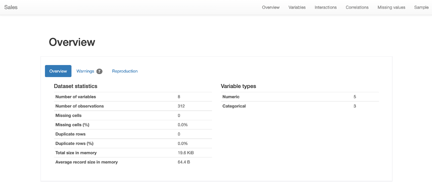
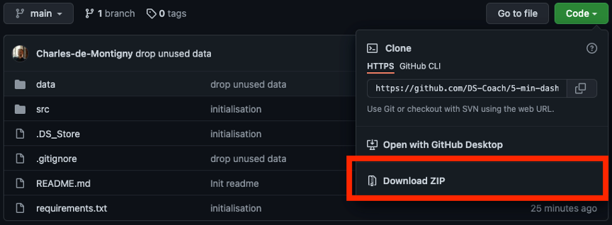

# 5-min-dashboard
Créer un tableau de bord Pandas Profiling en 5 minutes chrono.

Voilà un *screenshot* du résultat:




## Ingrédients nécessaires
* Python 3 installé sur son poste

* 5 minutes de temps disponible

* Ta bonne humeur


## Démarrage 

1- Télécharger le répertoire



2- Ouvrir le terminal et se rendre dans le dossier

```
cd 5-min-dashboard
```

3- Charger les *packages*

```
pip install -r requirements.txt
```

4- Rouler le script Python

```python
python src/dashboard_5min.py
```

## Les options

### Ton propre fichier de données:

```python
python src/dashboard_5min.py -f data/INSERER_TON_FICHIER.csv

python src/dashboard_5min.py -f data/retail_sales_data.csv
```

### Ton propre titre

```python
python src/dashboard_5min.py -t CECI_EST_UN_TITRE_COOL
```

### Ne pas calculer les corrélations
```python
python src/dashboard_5min.py --minimal
```

### Échantillon de données 

Exemple prendre 50 % des lignes aléatoirement.

```python
python src/dashboard_5min.py -s 0.5
```

